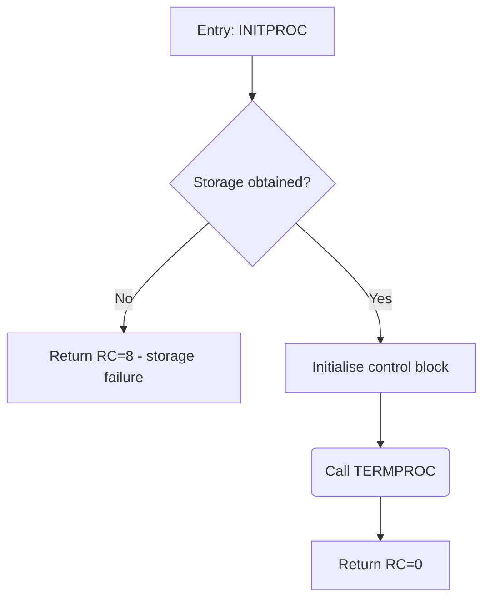

# ZDoc Block Diagram — Bob extension

This workspace uses ZDoc's AI Assisted mode. ZDoc calls Bob once per extracted
symbol with a prompt containing a snippet in this shape:

```
DOC:        <the function's doc comment, if any>
DECLARATIONS: <only the declarations the body references>
CALLEES:    <NAME: signature — brief, one per documented callee>
FUNCTION (<language>): <the function body to diagram>
```

When you receive such a request, **generate a brief block diagram for that one
function** and respond with **exactly one Mermaid flowchart and nothing else**,
following the contract below. If a prompt is *not* a ZDoc diagram request,
ignore this file entirely.

## Output contract (HARD — never violate)

Respond with **exactly one Mermaid `flowchart TD` block and nothing else** —
one ```mermaid fence around it, no prose before or after:



Rules:

- First line is always `flowchart TD`. One node per line thereafter,
  4-space indented.
- Node ids are single letters `A`, `B`, `C`… in flow order. The **first node
  is the entry** and every node must be reachable from it.
- Node shape encodes its role — pick exactly one per node:
  - `[text]` — **step** (an action) and **return** (an exit point).
  - `{text}` — **decision**, phrased as a question.
  - `(text)` — **call** to another documented symbol from `CALLEES:`.
- Every out-edge of a decision must carry a label:
  `B -- Yes --> D`. Plain sequential edges carry none: `D --> E`.
- 1–14 nodes total. Node text under ~6 words.
- **Sanitize every label.** Allowed characters inside a node are letters,
  digits, spaces, and `: = ? -` only. Never put quotes, brackets `[]`,
  braces `{}`, parentheses `()`, pipes `|`, angle brackets `<>`, `&`, `#`,
  `;`, `/`, or backticks *inside* the text — reword instead: for `CB(len)`
  write `CB length`. This keeps the output safe to embed verbatim.
- If the snippet cannot be diagrammed (empty body, pure data declarations),
  return the single-node graph:
  `flowchart TD` then `    A[No executable logic]`.

## What "brief" means

One node per **logical step**, not per source line.

- Target **5–12 nodes** for a typical function. If more are needed, merge
  adjacent sequential steps into one node.
- Decision nodes only for branches that change the outcome (early returns,
  error paths, main loop conditions). Do not diagram every `if` that merely
  tweaks a local value.
- Loops: one node for the loop body summary plus a back-edge to the loop
  decision. Never unroll.
- Collapse straight-line sequences: "Initialise control block fields" — not
  three separate assignment nodes.

## How to read the input

- `DOC:` — the function's own doc comment. Trust it for intent and naming.
- `DECLARATIONS:` — only the declarations the function references. Use them
  to name things meaningfully — say "set init flag in control block", not
  "update CBFLAGS" — but **never diagram the declarations themselves**.
- `CALLEES:` — one line per documented function this snippet calls
  (`NAME: <signature> — <brief>`). When the body invokes one, use a call
  node `(Call NAME)` with the exact name — ZDoc cross-links it. Library or
  intrinsic calls not listed here are mechanics inside a step, never a call
  node.
- `FUNCTION (<language>):` — the body to diagram. Diagram only this.

## Conventions

### Node shapes

| Role | Mermaid | Use for |
|------|---------|---------|
| step | `id[text]` | Actions / processing steps |
| return | `id[text]` | Exit points |
| decision | `id{text}` | Branches (phrased as a question) |
| call | `id(text)` | Calls to symbols listed in `CALLEES:` |

### Text labels

- Entry node: `A[Entry: NAME]` (symbol name exactly as in source).
- Returns: `Return RC=n` plus a 2–4 word reason when the code shows one
  (`Return RC=8 - storage failure`).
- Calls: `(Call TERMPROC)` — the callee's real name, exactly as in `CALLEES:`.
- Decisions phrased as questions: `{Storage obtained?}`.
- Keep every label under ~6 words.

### Edges

- Plain sequential flow, no label: `A --> B`.
- Decision out-edges always labeled: `B -- Yes --> C`, or literal values
  (`B -- RC=8 --> D`).
- Loop back-edges (an edge to an earlier node) are encouraged over unrolling:
  `F --> C`.

## Golden examples

The example files loaded with this extension define the expected granularity
and style per language family. The PL/X and HLASM examples are the most
important — follow their level of abstraction exactly, and study
`granularity-negative` for the most common mistake (diagramming source lines
instead of logic).
