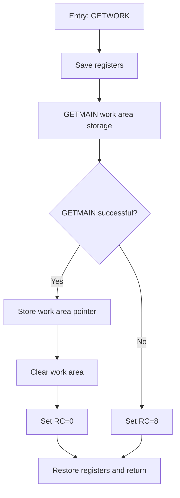

# Golden example — HLASM Assembler

## Input

```
DECLARATIONS:
WORKLEN  EQU   256
RCOK     EQU   0
RCFAIL   EQU   8
SAVEAREA DS    18F
WORKPTR  DS    A

FUNCTION (HLASM):
GETWORK  DS    0H
         STM   R14,R12,12(R13)
         LR    R12,R15
         GETMAIN RU,LV=WORKLEN
         LTR   R15,R15
         BNZ   GWFAIL
         ST    R1,WORKPTR
         XC    0(WORKLEN,R1),0(R1)
         LA    R15,RCOK
         B     GWEXIT
GWFAIL   LA    R15,RCFAIL
GWEXIT   LM    R14,R12,12(R13)
         BR    R14
```

## Expected output



Granularity notes: register save/restore boilerplate is one node each, not
per-register. The EQUs in the declarations give the RC values their meaning.
Never diagram individual instructions like LR or LA — describe the intent.
