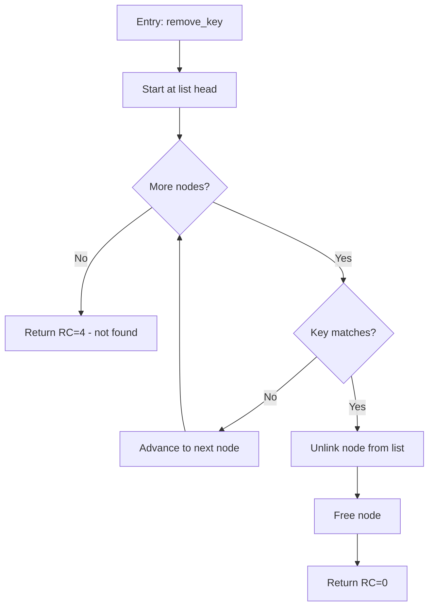

# Golden example — C

## Input

```
DOC:
Remove the first node whose key matches, if any.

DECLARATIONS:
typedef struct node {
    char key[16];
    struct node *next;
} node_t;
extern node_t *g_head;
#define RC_OK 0
#define RC_NOTFOUND 4

FUNCTION (C):
int remove_key(const char *key) {
    node_t *cur = g_head, *prev = NULL;
    while (cur != NULL) {
        if (strcmp(cur->key, key) == 0) {
            if (prev == NULL)
                g_head = cur->next;
            else
                prev->next = cur->next;
            free(cur);
            return RC_OK;
        }
        prev = cur;
        cur = cur->next;
    }
    return RC_NOTFOUND;
}
```

## Expected output



Granularity notes: the head-vs-middle unlink branch collapses into one
"Unlink node from list" node — it does not change the outcome, only the
mechanics. The loop is a decision node with a back-edge (`F → C`), not
unrolled.
