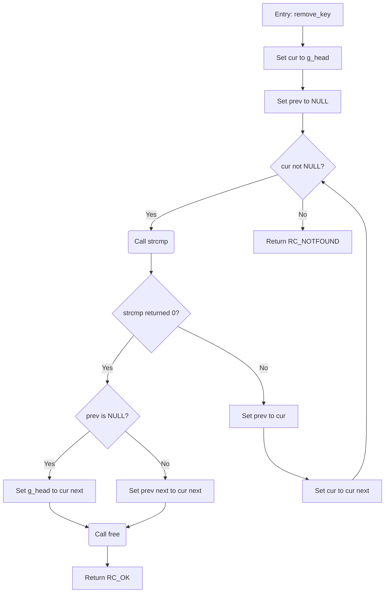

# Negative example — too detailed

The most common mistake is diagramming source lines instead of logic. For
the C golden example (`remove_key`), this answer is **WRONG**:

Why it is wrong:

- **Two init assignments** (`B`, `C`) are one logical step: "Start at list
  head".
- **`strcmp` and `free` are library calls**, not documented project symbols
  from `CALLEES:` — they are mechanics inside a step, never call nodes.
- **The `prev == NULL` branch** (`G`/`H`/`I`) doesn't change the outcome,
  only the unlink mechanics — one "Unlink node from list" step.
- **Raw identifiers** (`RC_OK`, `g_head`, `cur next`) leak source text into
  labels; the declarations exist so you can write "Return RC=0" and
  "Advance to next node".

The correct answer is in [c-example-1.md](c-example-1.md): nine nodes, one
per logical step, `call` nodes only for symbols listed under `CALLEES:`.
