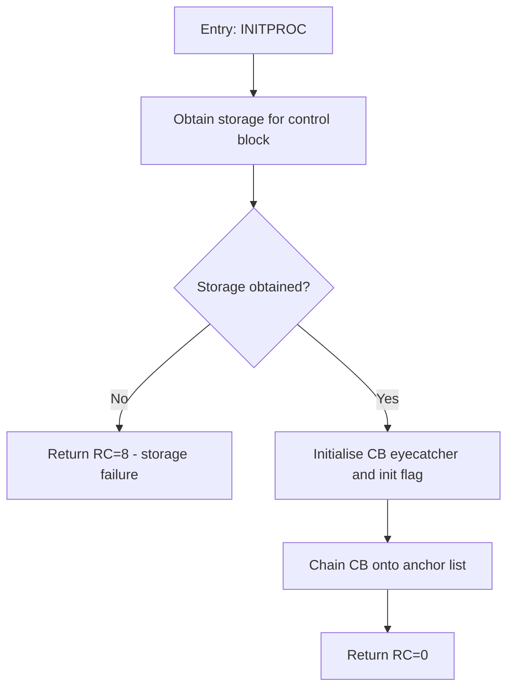

# Golden example — PL/X

## Input

```
DECLARATIONS:
DCL 1 CB BASED(CBPTR),
      2 CBEYE   CHAR(4),
      2 CBFLAGS BIT(8),
      2 CBNEXT  PTR;
DCL CBINIT BIT(8) CONSTANT('80'X);
DCL CBSTG FIXED BIN(31);
DCL 1 ANCH BASED(ANCHOR),
      2 ANCHEYE  CHAR(4),
      2 ANCHFRST PTR;

FUNCTION (PL/X):
INITPROC: PROC(ANCHOR) RETURNS(FIXED BIN(31));
    CBSTG = OBTAIN(LENGTH(CB));
    IF CBSTG = 0 THEN
        RETURN(8);
    CBPTR = CBSTG;
    CBPTR->CBEYE = 'ZDCB';
    CBPTR->CBFLAGS = CBINIT;
    CBPTR->CBNEXT = ANCHOR->ANCHFRST;
    ANCHOR->ANCHFRST = CBPTR;
    RETURN(0);
END INITPROC;
```

## Expected output



Note the granularity: three assignment statements collapse into one
"Initialise" node; the two chaining assignments collapse into one "Chain"
node. The declarations told us CBFLAGS/CBINIT mean an init flag and ANCHFRST
is a list head — that knowledge appears in the node labels, but the
declarations themselves are not diagrammed.
