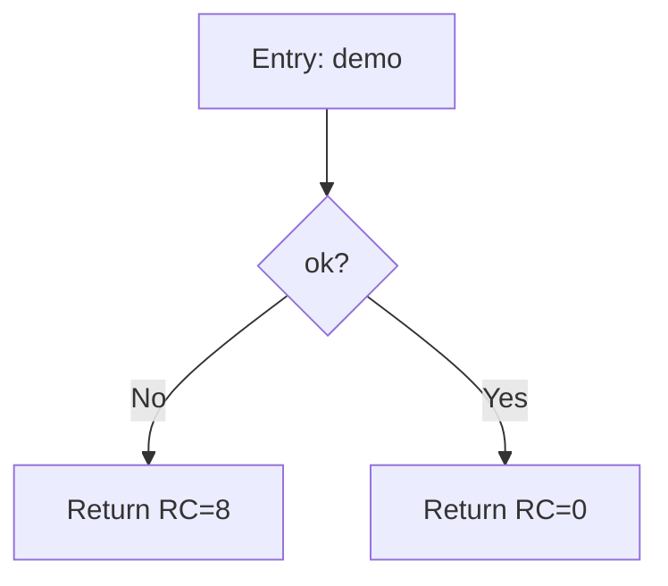

# AI Front — Testing, Remaining Work, Cross-Platform

Working notes for the AI Assisted mode (`--mode ai`). Covers how to test the
`bob_client` closure today, what still has to be built around it, and how to make
it run on Windows as well as POSIX.

Current state: `ai/bob_client/` is a library unit with two composable halves:

- **Context closure** (`closure.c` / `util.c`) — assembles the exact
  `DOC / DECLARATIONS / CALLEES / FUNCTION` snippet the skill expects, selecting
  only the declarations a body references (see §Context closure below).
- **Invocation + sanitize** (`bob_client.c`) — shells out to Bob and sanitizes
  the response into an embeddable Mermaid flowchart.

Bob's output contract is defined by the `zdoc-diagram` **Bob extension** in
`.bob/extensions/zdoc-diagram/` (`bob-extension.json` + `context.md` +
`examples/`). Both halves are unit-testable today; nothing in the pipeline calls
them yet.

---

## 1. How to test it

The closure has no binary of its own, so testing means (a) compiling it and
(b) driving `bob_diagram()` / `bob_annotate()` from a small harness. Because Bob
is reached through `execvp`, you can point `cfg.cli` at a **stub script** and
exercise the entire spawn → capture → sanitize path with no real Bob CLI, no
network, and no API key. This is the primary test strategy.

### 1a. Compile check + closure test

```sh
cd ai/bob_client && make all    # builds bob_client.o closure.o util.o
make test                       # builds + runs tests/test_closure.c
```

`make all` expects one warning, and only one: `init_resources()` in
`parser_shared.h` (pre-existing, not from this code). `make test` prints
`test_closure: all tests passed` — it covers the declaration index (case folding,
`BASED`-pointer resolution), the budgeted tiering (transitive drop, "never zero
context"), snippet section ordering, and keyword-filtered ref extraction, using
the PL/X golden example as its fixture. No Bob needed for this test.

### 1b. Fake-bob unit test (no real Bob needed)

Create a stub that ignores its args and prints a skill-style response:

```sh
cat > /tmp/fake-bob <<'SH'
#!/bin/sh
cat <<'OUT'
Here is your diagram:

OUT
SH
chmod +x /tmp/fake-bob
```

Driver:

```c
/* tbob.c */
#include "bob_client.h"
#include <stdio.h>
#include <stdlib.h>

int main(void) {
    BobConfig cfg = bob_config_default();
    cfg.cli = "/tmp/fake-bob";

    char *d = bob_diagram(&cfg, "C", "int demo(void){ return 0; }");
    printf("== good bob ==\n%s\n", d ? d : "(NULL)");
    free(d);

    cfg.cli = "/tmp/does-not-exist";           /* exec fails -> NULL */
    char *n = bob_diagram(&cfg, "C", "x");
    printf("== missing bob ==\n%s\n", n ? n : "(NULL)");
    free(n);
    return 0;
}
```

```sh
cc -std=c11 -Wall -Wextra -Iai/bob_client tbob.c ai/bob_client/bob_client.c -o /tmp/tbob
/tmp/tbob
```

Verified output: the good path prints the flowchart with the surrounding prose
**and** the ```` ```mermaid ```` fence stripped; the missing-bob path prints
`(NULL)`.

### 1c. Cases worth a fixture each

Each is just a different `fake-bob` body (or config), asserting the return:

| Case | fake-bob prints | Expected |
|------|-----------------|----------|
| Fenced block | ```` ```mermaid\nflowchart TD... ``` ```` | flowchart, no fence |
| Prose around fence | text + fence + text | flowchart only |
| Bare, no fence | `flowchart TD ...` | flowchart |
| Backticks / control chars in body | `flow`\`chart` … | stripped, still valid |
| No flowchart at all | `sorry, cannot` | `NULL` |
| Empty output | (nothing) | `NULL` |
| Non-zero exit | `exit 1` after printing | `NULL` (exit code gate) |
| Missing binary | `cfg.cli = "/no/such"` | `NULL` |
| `bob_annotate` | any good body | `sym->diagram` set, old value freed |

Run the whole file under Valgrind / ASan to confirm no leaks on both the
success and failure paths:

```sh
cc -std=c11 -g -fsanitize=address tbob.c ai/bob_client/bob_client.c -o /tmp/tbob && /tmp/tbob
```

A permanent home for these would be `ai/bob_client/tests/` with a stub script
and a `test.c`, wired into the Makefile's `test` target — mirroring
`parser/*/tests/`.

### 1d. Real Bob integration

Real Bob ("Bob Shell", 1.0.6) is a one-shot **prompt agent** — `bob "<prompt>"`,
not the `explain --diagram` command `docs/ZDOC.md` imagined. And Bob has no
"skills": diagram rules ship as a **Bob extension** (`bob-extension.json` +
context files). Two steps:

1. **Link the extension** so its context shapes Bob's answers:

   ```sh
   bob extensions validate .bob/extensions/zdoc-diagram   # sanity check (no API)
   bob extensions link     .bob/extensions/zdoc-diagram   # activate it
   ```

2. **Run the end-to-end harness** (spends Bob credits):

   ```sh
   cd ai/bob_client && make live
   ```

   `bob_client` invokes `bob -o text --chat-mode ask -y "<instruction>\n\n<snippet>"`;
   the extension supplies the output contract, and the sanitizer extracts the
   fence-less flowchart. `make live` prints the snippet sent and the diagram
   returned, exit 0 iff a diagram came back.

---

## 2. What's left on the AI front

Roughly in dependency order.

1. **Parser must expose bodies + a declaration pool (blocker).** The context
   closure needs three things per module the parser does not yet provide:
   (a) each symbol's **body text** — `Symbol` (see
   `parser/shared/parser_shared.h`) carries `name`, `signature`, doc fields,
   `line`, and `diagram`, but no body; (b) the module's **declarations** as
   `bc_decl` (name(s) + verbatim text) to build the index; (c) **callee lines**
   for the `CALLEES:` section. Options: add a `body` field + a declarations list
   to the parsed model, or a helper that slices the source file from
   `symbol->line` to the end of the function and harvests declarations. Until
   this exists the closure has nothing to select from. This is the single most
   important missing piece — but note the closure is already written and tested,
   so this is a parser-side data-exposure task, not new AI logic.

2. **AI-mode CLI / driver.** The separate entry point that orchestrates
   parse → per-symbol snippet → `bob_annotate` → render. Owns the `--mode ai`,
   `--bob-cli`, `--bob-args` options from `docs/ZDOC.md` and builds the
   `BobConfig`.

3. **Language mapping.** `bob_diagram` takes a language *string*
   (`"C"`, `"PL/X"`, `"HLASM"`, `"Java"`, …). `parser_interface`'s
   `enum Language` only covers `C`, `JAVA`, `PLX` today. Need a table from
   extension/enum to the skill's expected tokens, plus coverage for PLAS, C++,
   Assembler, Pascal.

4. **Concurrency + rate limiting.** The daemon already parses files in parallel
   (`zdoc/threading_interface/`). Bob calls are slow, network-bound, and there is
   one per symbol — potentially thousands per run. `bob_diagram` is synchronous
   and blocking. Needs a bounded worker pool and probably rate-limit / backoff so
   a large repo doesn't fan out into thousands of concurrent subprocesses.

5. **Timeouts.** A hung Bob call currently blocks forever (`read` then
   `waitpid`). Add a timeout (e.g. `alarm` + kill the child, or `poll` the pipe
   fd with a deadline). Consider growing `BobConfig` with a `timeout_secs`.

6. **Failure policy.** `bob_annotate` returns `-1` and leaves `diagram` NULL on
   failure. `docs/ZDOC.md` says to insert a note when a diagram can't be
   produced. Decide: silent skip, "diagram unavailable" placeholder, or N retries
   — and make the renderers honor it.

7. **Renderer integration.** `renderer/md_renderer` and `renderer/html_renderer`
   must emit `Symbol.diagram`: fenced ```` ```mermaid ```` for Markdown, raw block
   + Mermaid.js for HTML, and the offline/failure note when `diagram == NULL`.
   These appear to be stubs today.

8. **Config plumbing.** Parse `zdoc.yaml` (`mode`, `bob_cli`, `bob_args`) into a
   `BobConfig`; CLI flags override the file.

9. **Diagram caching (optional, high value).** Key a cache on a hash of the
   snippet so unchanged functions aren't re-sent to Bob across runs. Big cost and
   latency win on re-documentation; listed on the `ZDOC.md` roadmap in spirit.

10. **Test fixtures + CI.** Promote §1 into `ai/bob_client/tests/` with a stub
    Bob and a `make test` target, so the sanitizer contract is regression-tested.

---

## 3. Making it cross-platform

`bob_client.c` is **POSIX-only** today: `fork`, `pipe`, `execvp`, `waitpid`,
`dup2`, `read`, `_exit`, `strtok_r`, `ssize_t`, `_POSIX_C_SOURCE`. On Linux and
macOS it just works. On Windows it works **only** under an emulation layer that
provides `fork` (MSYS2 / Cygwin) — plain MinGW does *not* have `fork`, and MSVC
has none of these.

### The one hard part: argument passing

The reason the POSIX code is clean and injection-proof is that `execvp` takes an
**argv array** — the snippet is one element, no quoting, ever. Windows
`CreateProcess` takes a **single command-line string** instead, so the snippet
(arbitrary source with quotes, backslashes, newlines) would have to be quoted per
the Windows `CommandLineToArgvW` rules. That reintroduces exactly the escaping
hazard we designed away.

**Recommended fix: deliver the snippet over stdin, not as an argument.** If the
Bob CLI reads the snippet from stdin (e.g. `--snippet -`, or "read stdin when
`--snippet` is omitted"), then *neither* platform has to quote anything — the
argv/command-line only ever holds fixed flags. This is the cleanest path and the
one change that most simplifies the Windows port. It needs a small Bob CLI
capability, so flag it as a dependency.

### Structure: isolate the OS in one seam

Extract a single abstraction and give it two implementations:

```c
/* spawn.h */
int spawn_capture(const char *cli, char *const argv[],
                  const char *stdin_data,   /* may be NULL */
                  char **out, int *exit_code);
```

- **POSIX impl** = the current `run_bob` body (pipe/fork/execvp/waitpid), plus a
  second pipe to write `stdin_data` to the child if used.
- **Windows impl** = `CreatePipe` (with `SECURITY_ATTRIBUTES.bInheritHandle =
  TRUE`) for stdout and stdin, `CreateProcess` with `STARTF_USESTDHANDLES`,
  `ReadFile` to drain stdout, `WriteFile` for the snippet, `WaitForSingleObject`
  + `GetExitCodeProcess`. Feeding the snippet via stdin avoids building a quoted
  command line entirely.

`bob_client.c` above the seam (`extract_diagram`, `split_args`, `bob_diagram`,
`bob_annotate`) is already portable and stays as-is.

### Smaller portability items

- **`strtok_r`** → `strtok_s` on MSVC (same semantics). One macro:
  `#ifdef _WIN32 #define strtok_r strtok_s #endif` (MSVC's `strtok_s` has the
  same 3-arg signature).
- **`_POSIX_C_SOURCE`** → only define it off Windows: guard with
  `#if !defined(_WIN32)`.
- **`ssize_t`** is POSIX; on Windows use `SSIZE_T` (from `<BaseTsd.h>`) or plain
  `int` inside the Windows spawn impl.
- **`_exit`** (child-side, POSIX) has no analog above the seam — it lives only in
  the POSIX spawn impl, so nothing to port.
- **Build**: keep the current Makefile for POSIX; add an MSVC/MinGW build (or a
  CMake target) that compiles `spawn_win.c` instead of `spawn_posix.c`. Decide
  the Windows support floor: "MSYS2/Cygwin only" (cheap — current code already
  runs there) vs. "native MSVC" (needs the `spawn_win.c` implementation above).

### Recommended sequence

1. Refactor `run_bob` to sit on `spawn_capture` (no behavior change on POSIX).
2. Switch snippet delivery to stdin (needs the Bob CLI change) — removes the
   Windows quoting problem before it exists.
3. Add `spawn_win.c` and the `strtok_r`/`_POSIX_C_SOURCE`/`ssize_t` guards.
4. Add a Windows build target and run the §1 fake-bob tests there (the stub
   becomes a `.cmd` or a small exe).
