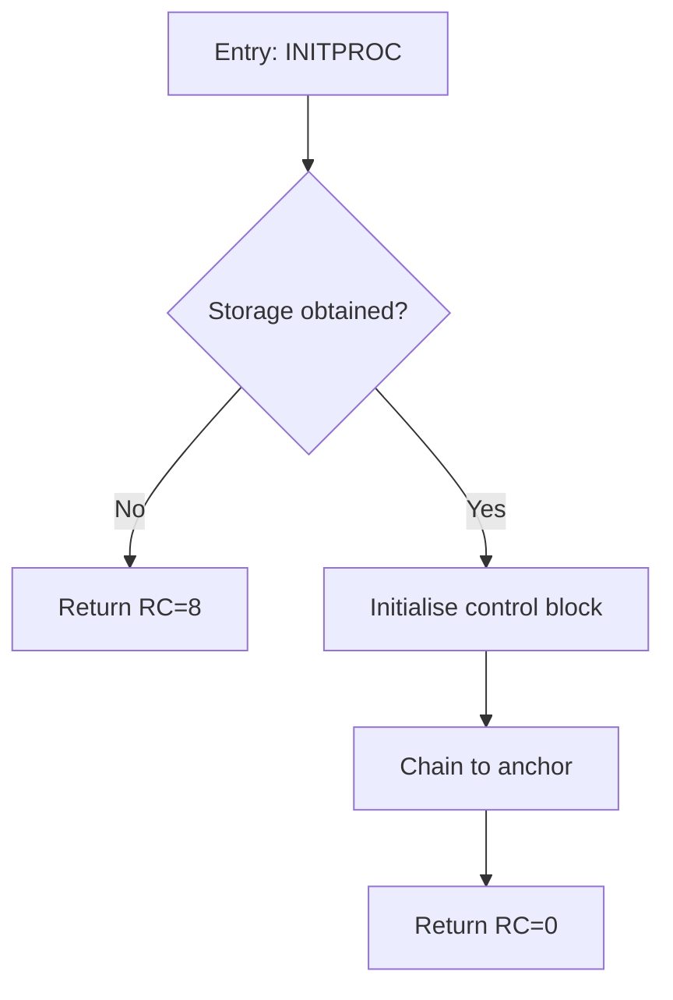

# ZDoc — Documentation Generator for Legacy and Modern Languages

## Overview

ZDoc is a documentation generation tool designed to extract and present structured documentation from source files written in **PL/X**, **PLAS**, **C**, **C++**, **Java**, **Assembler**, and **Pascal**. It operates similarly to Doxygen or JavaDoc, but is purpose-built for mainframe and mixed-language codebases.

Each source module (file) is rendered as an expandable node in the output. Where documentation comments are present, they are surfaced per function, macro, entry point, or declaration. ZDoc supports two operating modes: **Offline** and **AI Assisted**.

---

## Supported Languages

| Language   | File Extensions               |
|------------|-------------------------------|
| PL/X       | `.plx`, `.pls`                |
| PLAS       | `.plas`                       |
| C          | `.c`, `.h`                    |
| C++        | `.cpp`, `.cxx`, `.cc`, `.hpp` |
| Java       | `.java`                       |
| Assembler  | `.asm`, `.s`, `.mac`          |
| Pascal     | `.pas`, `.pp`                 |

---

## Operating Modes

### Offline Mode

In offline mode ZDoc parses source files and extracts documentation purely from the source itself — no external services are called.

**What it does:**
- Parses doc-comment blocks
- Extracts function/procedure/entry signatures and declarations
- Builds the module tree
- Emits output in Markdown or HTML

**When to use it:**
- Air-gapped or restricted environments
- CI pipelines without AI access
- Quick local documentation runs

---

### AI Assisted Mode

In AI assisted mode ZDoc invokes the **Bob CLI** for each function or declaration that has been extracted. Bob generates a **brief block diagram** (detailed design level) for that function based on its source body.

**What it does (in addition to offline):**
- Calls `bob` CLI per function: `bob explain --diagram --brief <source_snippet>`
- Inserts the returned block diagram into the function's documentation section
- Diagrams are rendered as inline Mermaid flowcharts (in HTML output) or fenced Mermaid code blocks (in Markdown output)

**When to use it:**
- Generating first-pass detailed design documentation
- Onboarding developers to unfamiliar code
- Producing architecture review artefacts

**Requirements:**
- Bob CLI must be installed and on `PATH`
- A valid Bob session / API key must be configured

---

## Output Structure

### Module Tree

Each source file is represented as an expandable node. Clicking (HTML) or expanding (Markdown heading) a module reveals its contents:

```
▶ mymodule.plx
    ├── INITPROC     — Initialise subsystem
    ├── TERMPROC     — Terminate subsystem
    └── MAINPROC     — Main processing entry
```

### Per-Symbol Section

Each extracted symbol renders:

1. **Signature** — the full function/procedure/entry prototype
2. **Brief** — one-line description
3. **Parameters** — table of parameter entries
4. **Returns** — return value description
5. **Notes** — additional notes
6. **Block Diagram** *(AI Assisted only)* — Mermaid flowchart of the function body
7. **Cross-references** — links to related symbols

---

## Output Formats

### Markdown

- One `.md` file per module, plus a root `index.md` with the module tree
- Block diagrams rendered as fenced ` ```mermaid ``` ` blocks
- GitHub / GitLab / Obsidian compatible

### HTML

- Single self-contained `index.html` with embedded CSS and JavaScript
- Expandable module nodes via `<details>`/`<summary>`
- Block diagrams rendered via the Mermaid JS library (bundled or CDN)
- No external dependencies required for offline HTML output

---

## CLI Usage

```
zdoc [options] <source_dir_or_file> [<source_dir_or_file> ...]
```

### Options

| Option                   | Description                                                  |
|--------------------------|--------------------------------------------------------------|
| `--mode offline`         | Run in offline mode (default)                                |
| `--mode ai`              | Run in AI assisted mode (requires Bob CLI)                   |
| `--output-format md`     | Emit Markdown output (default)                               |
| `--output-format html`   | Emit HTML output                                             |
| `--out-dir <path>`       | Directory to write output files (default: `./zdoc-out`)      |
| `--lang <lang>[,<lang>]` | Restrict processing to listed languages                      |
| `--recursive`            | Recurse into subdirectories                                  |
| `--exclude <glob>`       | Exclude files matching glob pattern                          |
| `--bob-cli <path>`       | Path to Bob CLI binary (default: `bob` on PATH)              |
| `--bob-args <args>`      | Additional arguments forwarded to Bob CLI                    |
| `--title <string>`       | Project title shown in the output                            |
| `--no-source`            | Omit source snippets from output                             |
| `--version`              | Print ZDoc version                                           |
| `--help`                 | Print help                                                   |

### Examples

**Offline Markdown documentation for a directory:**
```sh
zdoc --mode offline --output-format md --recursive ./src
```

**AI Assisted HTML documentation:**
```sh
zdoc --mode ai --output-format html --out-dir ./docs --title "My Project" ./src
```

**Single file, offline, HTML:**
```sh
zdoc --output-format html ./src/mymodule.plx
```

---

## Configuration File

ZDoc reads an optional `zdoc.yaml` (or `zdoc.json`) in the working directory.

```yaml
# zdoc.yaml
title: "My Project Documentation"
mode: offline                  # offline | ai
output_format: html            # md | html
out_dir: ./docs
recursive: true
languages:
  - plx
  - c
  - assembler
exclude:
  - "**/*.test.c"
  - "**/test/**"
bob_cli: bob
bob_args: "--session default"
```

Command-line options always override the configuration file.

---

## AI Assisted — Bob CLI Integration

When `--mode ai` is active, ZDoc builds a focused prompt for each extracted function and calls Bob CLI:

```
bob explain --diagram --brief --lang <detected_language> --snippet "<function_source>"
```

Bob returns a Mermaid flowchart block, for example:



ZDoc inserts this block directly into the function's documentation section.

### Diagram Depth

Bob generates **brief (basic) block diagrams** — one diagram box per logical step, not per source line. The intent is a readable detailed-design overview, not a line-by-line trace.

---

## Architecture

```
zdoc
├── parser/
│   ├── plx_parser       — PL/X and PLAS parser
│   ├── c_parser         — C and C++ parser
│   ├── java_parser      — Java parser
│   ├── asm_parser       — Assembler parser
│   └── pascal_parser    — Pascal parser
├── extractor/
│   └── doc_extractor    — Comment block and tag extractor (shared)
├── ai/
│   └── bob_client       — Bob CLI invocation and response parsing
├── renderer/
│   ├── md_renderer      — Markdown output renderer
│   └── html_renderer    — HTML output renderer
└── zdoc                 — CLI entry point
```

---

## Output Example — Markdown

````markdown
# Module: mymodule.plx

<details>
<summary><strong>INITPROC</strong> — Initialise subsystem</summary>

**Signature**
```plx
INITPROC: PROC(ANCHOR) RETURNS(FIXED BIN(31));
```

**Parameters**

| Name   | Description          |
|--------|----------------------|
| ANCHOR | Pointer to anchor CB |

**Returns**
Return code: 0 = success, 8 = storage failure.

**Block Diagram** *(AI Assisted)*


</details>
````

---

## Limitations

- AI assisted mode requires network access to the Bob service and a valid authentication token.
- Mermaid diagram rendering in HTML requires JavaScript. For fully static offline HTML without JS, diagrams are omitted and a note is inserted instead.
- Macro-heavy Assembler or PL/X files may require pre-expansion before accurate parsing; ZDoc processes the raw source by default.
- Nested include files are not followed automatically; use `--recursive` on the include directories separately.

---

## Roadmap

- [ ] Cross-module call graph generation
- [ ] Deprecated symbols index page
- [ ] Side-by-side source view in HTML output
- [ ] REXX language support
- [ ] COBOL language support
- [ ] VS Code extension for inline ZDoc preview
- [ ] Bob CLI streaming support for large functions

---

## License

ZDoc is an internal tool. Refer to your organisation's licence agreement.