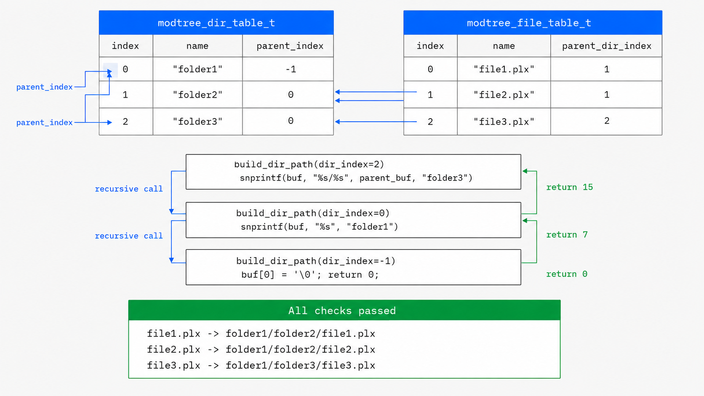

# module_tree

Builds ZDoc's **module tree**: the directory/file structure of the documented
sources, held as two flat tables and reassembled into real paths on demand.

Instead of storing a full path string on every node, each directory and file
stores only **its own name** plus the **index of its parent**. Full paths
(`folder1/folder2/file1.plx`) are never stored — they're reconstructed by
walking the parent links. This keeps the tables compact and the tree cheap to
build while parsing.

- **Layer:** `extractor/` → part of [`doc_extractor`](../README.md)
- **Feeds:** the [renderers](../../../renderer/README.md), which walk this tree to draw the modular view
- **Status:** In progress

---

## How it works



The diagram shows the two ideas behind the module:

1. **Two index-linked tables.** `modtree_dir_table_t` holds directories
   (`name`, `parent_index`; root's parent is `-1`). `modtree_file_table_t` holds
   files (`name`, `parent_dir_index` pointing into the directory table).
2. **Recursive path reconstruction.** `build_dir_path` follows `parent_index`
   up to the root, then builds the path back down with `snprintf`
   (`"%s/%s"`). A file's path is its directory's path plus the file name.

Example result:

```
file1.plx -> folder1/folder2/file1.plx
file2.plx -> folder1/folder2/file2.plx
file3.plx -> folder1/folder3/file3.plx
```

---

## Data model

| Table                  | Entry            | Fields                          | Meaning                                        |
|------------------------|------------------|---------------------------------|------------------------------------------------|
| `modtree_dir_table_t`  | `modtree_dir_t`  | `name`, `parent_index`          | a directory; `parent_index == -1` is the root  |
| `modtree_file_table_t` | `modtree_file_t` | `name`, `parent_dir_index`      | a file, living in one directory                |

Both entries are a fixed 16-byte layout (a `static_assert` guards it). Tables
grow by doubling their capacity as entries are interned; insertion does **no**
de-duplication, because a tree walk never visits the same node twice.

---

## API

Declared in [`modtree_tables.h`](modtree_tables.h), implemented in
[`modtree_table.c`](modtree_table.c):

- **Lifecycle** — `modtree_dir_table_init` / `_free`,
  `modtree_file_table_init` / `_free`.
- **Insertion** — `modtree_intern_dir(t, name, parent_index)` and
  `modtree_intern_file(t, name, parent_dir_index)`; each returns the new
  entry's index (or `-1` on allocation failure).
- **Path reconstruction** —
  `modtree_dir_path(dirs, dir_index, out, out_size)` and
  `modtree_file_path(dirs, files, file_index, out, out_size)`; return `0` on
  success, `-1` if `out` was too small.
- **Filesystem walk** —
  `fs_walk(root_disk_path, dirs, files, extensions, extension_count)` recursively
  walks a real directory on disk, seeding the root then interning every
  subdirectory and every file whose extension matches one of `extensions` (each
  including the leading dot, e.g. `".c"`). Pass `extension_count == 0` to match
  every file. Returns `0` on success, `-1` if the root could not be opened or an
  allocation failed. Declared in [`fs_walk.h`](fs_walk.h), implemented in
  [`fs_walk.c`](fs_walk.c). The POSIX (`dirent`/`stat`) and Windows
  (`FindFirstFileA`) backends are isolated behind one internal interface; the
  shared walk logic contains no `#ifdef`.

---

## Building & running the demo

[`fs_walk_demo.c`](fs_walk_demo.c) is a small driver: it walks a folder, prints
both tables, then prints the reconstructed path for every file. Compile the
demo, the walker, and the table implementation together (no extra libraries are
needed — only libc):

```sh
cd extractor/doc_extractor/module_tree
cc -Wall -Wextra -std=c11 fs_walk_demo.c fs_walk.c modtree_table.c -o fs_walk_demo
```

Run it on any folder, optionally filtering by extension:

```sh
./fs_walk_demo <folder> [ext1 ext2 ...]   # no extensions -> matches every file
./fs_walk_demo . .c .h                     # this directory, C sources only
```

Example against a real C project:

```sh
./fs_walk_demo ~/Desktop/Quicx .c .h
```

```
...
reconstructed paths:
  Quicx/pmad/src/PMAD.c
  Quicx/quicx/src/server.c
  Quicx/quicx/include/queue.h
  ...

238 directories, 35 files
```

> **Note:** the walk currently descends into every directory, including `.git`
> (its `objects/` alone accounts for most of the 238 dirs above) and macOS
> `.dSYM` bundles. No source files matched inside them here, but skipping
> dot-directories and build-artifact bundles is a likely future refinement.

---

## Files

| File                                     | Purpose                                    |
|------------------------------------------|--------------------------------------------|
| [`modtree_tables.h`](modtree_tables.h)   | Table types and public API                 |
| [`modtree_table.c`](modtree_table.c)     | Table lifecycle, interning, path building  |
| [`fs_walk.h`](fs_walk.h)                  | Filesystem walk API                        |
| [`fs_walk.c`](fs_walk.c)                  | Recursive walk (POSIX + Windows backends)  |
| [`fs_walk_demo.c`](fs_walk_demo.c)       | CLI demo: walk a folder, print the tree    |
| [`test.c`](test.c)                       | Self-checks for the tables and path output |
| `ZDoc_modtree_diagram.png`               | The diagram above                          |

---

## Where it fits

`module_tree` sits inside the shared [`doc_extractor`](../README.md) stage,
between the [parsers](../../../parser/README.md) (which discover the source
files) and the [renderers](../../../renderer/README.md) (which draw the tree).
See [`docs/ZDOC.md`](../../../docs/ZDOC.md) for the full specification.
