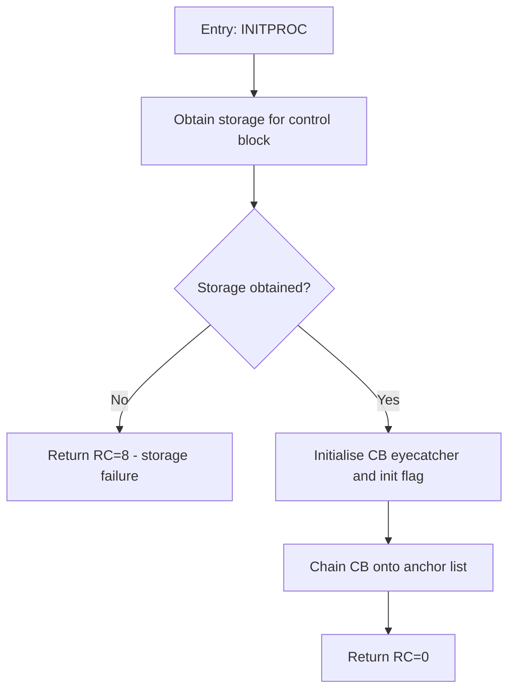
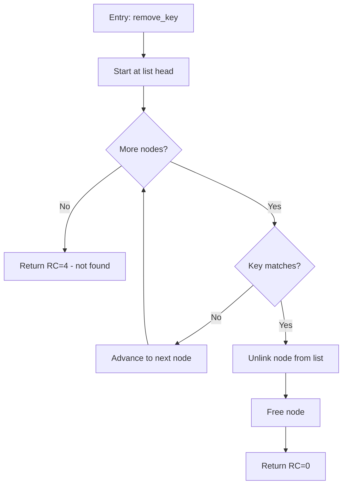
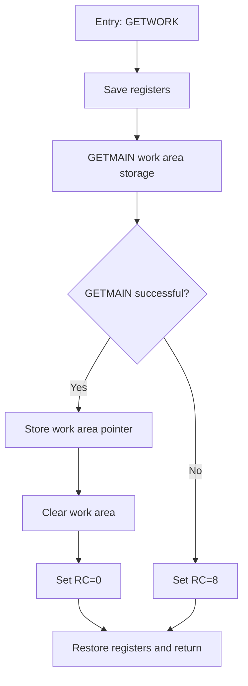

# ZDoc AI Mode — Implementation Brief (for Claude Code)

You are working in the **ZDoc** repository: a documentation generator in **C**
for PL/X, PLAS, C, C++, Java, HLASM Assembler, and Pascal source. Offline mode
(parse → extract doc comments → render md/html) exists; this brief implements
**AI Assisted mode**, which calls the IBM Bob CLI once per extracted function
to get a brief Mermaid block diagram and embeds it in the output.

Before writing code, read the existing parser/IR headers and adapt the struct
and function names below to the project's actual conventions. The *behavior*
specified here is the contract; naming should match the codebase.

---

## Deliverables

1. `.bob/skills/zdoc-diagram/` — a Bob skill folder shipped with ZDoc
   (exact file contents given in §5; write them verbatim).
2. `src/ai/closure.c` + `src/ai/closure.h` — minimal closure assembly.
3. `src/ai/bob_client.c` + `src/ai/bob_client.h` — Bob CLI invocation,
   response validation, retry, fallback.
4. Wiring into the per-symbol pipeline behind `--mode ai`.
5. Unit tests (fixture-based) for closure assembly and validation.

Do NOT implement any skill librarian / skill management machinery.

---

## 1. IR requirements (extend if missing)

The parsers emit an intermediate representation. AI mode needs these fields —
add them if the current IR lacks them:

```c
typedef struct Declaration {
    char       **names;      /* every identifier this block introduces */
    size_t       name_count;
    char        *text;       /* verbatim source of the whole declaration */
    char       **refs;       /* identifiers this declaration itself uses */
    size_t       ref_count;  /* (e.g. a typedef using another typedef)   */
} Declaration;

typedef struct Symbol {
    char        *name;
    SymbolKind   kind;        /* function / proc / entry / macro */
    char        *signature;
    char        *doc_comment_raw;
    char        *source_body;
    int          line_start, line_end;
    char       **references; /* optional; NULL => derive from body (§2.2) */
    size_t       reference_count;
} Symbol;

typedef struct Module {
    char        *path;
    Language     language;   /* LANG_PLX, LANG_PLAS, LANG_C, LANG_CPP,
                                LANG_JAVA, LANG_ASM, LANG_PASCAL */
    Symbol      *symbols;      size_t symbol_count;
    Declaration *declarations; size_t declaration_count;
} Module;
```

**Critical rule for `Declaration.names`:** a declaration is indexed under
*every* name it introduces. A PL/X `DCL 1 CB BASED(CBPTR)` structure with
members CBEYE, CBFLAGS, CBNEXT must be findable via `CB`, `CBEYE`, `CBFLAGS`,
`CBNEXT`, **and** `CBPTR` — function bodies usually reference a member or the
base pointer, never the structure name. Same for C struct/union members and
typedef names, HLASM DSECT fields / EQU labels / DS/DC labels, and Pascal
record fields. The parsers already see these names; record them.

---

## 2. Closure assembly (`closure.c`)

Purpose: for one Symbol, collect **only** the declarations its body actually
references, so each Bob call gets enough context to name things meaningfully
("set init flag in control block", not "update CBFLAGS") without sending the
whole file.

### 2.1 Declaration index

Hash table mapping name → `Declaration*`. Build once per Module.

- Case folding: PL/X, PLAS, HLASM, Pascal are case-insensitive — fold keys
  and lookups to uppercase for those languages. C/C++/Java are case-sensitive.
- Multiple names map to the same `Declaration*`; dedupe later by pointer.

```c
DeclIndex *decl_index_build(const Module *m);
const Declaration *decl_index_lookup(const DeclIndex *idx, const char *name);
void decl_index_free(DeclIndex *idx);
```

### 2.2 Fallback reference extraction

If `symbol->references` is NULL, derive references by tokenizing the body:

- Identifier pattern: `[A-Za-z_$#@][A-Za-z0-9_$#@]*` (the `$#@` set is
  required for HLASM and PL/X names).
- Subtract a per-language keyword set (small static tables: control-flow
  keywords, type keywords, common builtins/opcodes — e.g. for HLASM include
  DS DC EQU CSECT DSECT USING STM LM BR GETMAIN FREEMAIN etc.; for PL/X
  include PROC END RETURN IF THEN ELSE DO DCL BASED PTR FIXED BIN CHAR...).
- **Over-collection is fine and intended.** Names that don't resolve in the
  index cost nothing. Precision comes from the lookup, not the tokenizer.
  Do not attempt real parsing here.

```c
StringSet *extract_references(const char *body, Language lang);
```

### 2.3 Closure algorithm

```c
/* Returns array of Declaration* in deterministic order. */
const Declaration **assemble_closure(const Symbol *sym,
                                     const DeclIndex *idx,
                                     Language lang,
                                     size_t max_chars,       /* default 4000 */
                                     int transitive_depth,   /* default 1 */
                                     size_t *out_count);
```

Rules:

1. **Tier 0 (direct):** for each referenced name (sorted alphabetically for
   determinism), look up the declaration; skip NULL; dedupe by pointer.
2. **Tier 1..N (transitive):** the `refs` of tier-k declarations seed
   tier k+1 (a struct using a typedef). Default depth 1.
3. **Budget:** total `strlen(text)` capped at `max_chars`. Fill tier 0
   completely before tier 1 — a transitive declaration must never crowd out
   a direct one. Within a tier keep the sorted order. If even the first
   declaration exceeds the budget, include it anyway (never send zero
   context when context exists).

### 2.4 Snippet format (must match the skill in §5)

```c
char *build_snippet(const Symbol *sym, const Declaration **closure,
                    size_t count, Language lang);
```

Produces exactly:

```
DECLARATIONS:
<decl 1 text>
<decl 2 text>

FUNCTION (<PL/X | PLAS | C | C++ | Java | HLASM | Pascal>):
<function body>
```

Omit the `DECLARATIONS:` section entirely when the closure is empty.

---

## 3. Bob client (`bob_client.c`)

### 3.1 Invocation

Spawn the Bob CLI per symbol (respect `--bob-cli <path>` and `--bob-args`
from config/CLI):

```
bob explain --diagram --brief --lang <lang> --snippet "<snippet>"
```

Implementation notes:

- Use `posix_spawn`/`fork+exec` with the snippet passed via **stdin or a
  temp file if the CLI supports it** — check `bob explain --help` first;
  argv has size limits and shell-quoting a snippet into argv is fragile.
  Never route through `system()` / a shell.
- Capture stdout fully; nonzero exit code = failure (goes to fallback path).
- Timeout per call (default 60 s, configurable); kill and treat as failure.

### 3.2 Response validation (the output contract, enforced mechanically)

`validate_response(const char *out)` returns the extracted mermaid body or
NULL. ALL of the following must hold:

1. Exactly **one** fenced block: ```` ```mermaid ... ``` ````.
2. Nothing but whitespace outside that block.
3. Block body starts with `flowchart TD`.
4. No `%%` and no `subgraph` in the body.
5. Balanced `[`/`]`, `{`/`}`, `(`/`)` counts.

### 3.3 Retry and fallback (per symbol — never abort the run)

1. Call Bob. If valid → embed diagram.
2. If invalid/failed → retry **once**, appending to the snippet:
   `Your previous response violated the output contract. Return ONLY one
   fenced mermaid block containing a single flowchart TD. No prose.`
3. If still invalid → embed the note
   `> *Block diagram unavailable for this function.*` and continue.
4. Log every failure (module, symbol, raw response) to
   `<out_dir>/zdoc-ai-failures.log` so bad cases can become new skill
   examples later.

### 3.4 Rendering

- Markdown renderer: insert the validated body inside a fenced
  ```` ```mermaid ```` block in the symbol's **Block Diagram** section.
- HTML renderer: insert as a `<pre class="mermaid">` node (Mermaid JS,
  bundled or CDN per existing renderer behavior).

---

## 4. Pipeline wiring

In the per-symbol loop, when `mode == ai`:

```
parse module -> build DeclIndex (once per module)
for each symbol:
    closure  = assemble_closure(...)
    snippet  = build_snippet(...)
    diagram  = bob_call_with_retry(snippet)   /* or fallback note */
    attach diagram to symbol's render data
free DeclIndex
```

Offline mode must be completely untouched — AI code compiles in but is only
reached behind the mode flag. `--no-source`, `--exclude`, `--lang` behave
identically in both modes.

**Macro caveat:** for macro-heavy HLASM/PL/X, unexpanded source yields
diagrams of macro *invocations*, not logic. Add a TODO hook for an optional
pre-expansion step; do not implement expansion now.

---

## 5. Skill files (write verbatim)

Create these five files. They ship with ZDoc; users copy `.bob/` into their
repo so every Bob CLI call auto-activates the skill.

### 5.1 `.bob/skills/zdoc-diagram/SKILL.md`

~~~markdown
---
name: zdoc-diagram
description: >
  Generate brief block diagrams (Mermaid flowcharts) for individual functions,
  procedures, and entry points in PL/X, PLAS, C, C++, Java, HLASM Assembler,
  and Pascal source code. Used by the ZDoc documentation generator, which
  invokes the Bob CLI once per extracted symbol. Activate whenever asked to
  explain a code snippet with a diagram, especially with the flags
  --diagram --brief.
---

# ZDoc Block Diagram Skill

You generate a **brief block diagram** for a single function that ZDoc will
embed into generated documentation. The consumer of your output is a machine
(the ZDoc renderer), so the output contract below is absolute.

## Output contract (HARD — never violate)

- Respond with **exactly one** fenced ```mermaid code block.
- The block contains a single `flowchart TD`.
- **No prose** before or after the block. No comments (`%%`) inside it.
- Node text must not contain unescaped `"`, `[`, `]`, `{`, `}` characters —
  rephrase instead of escaping.
- If the snippet cannot be diagrammed (empty body, pure data declarations),
  return a single-node flowchart: `flowchart TD` / `A[No executable logic]`.
  Still no prose.

## What "brief" means

One node per **logical step**, not per source line.

- Target **5–12 nodes** for a typical function. If more are needed, merge
  adjacent sequential steps into one node.
- Decision diamonds `{...}` only for branches that change the outcome
  (early returns, error paths, main loop conditions). Do not diagram every
  `if` that merely tweaks a local value.
- Loops: one node for the loop body summary plus a back-edge, or a decision
  node with a "repeat" edge. Never unroll.
- Collapse straight-line sequences: "Initialise control block fields" — not
  three separate assignment nodes.

## Naming and structure conventions

Full details in [conventions.md](conventions.md). Summary:

- Entry node: `A[Entry: FUNCNAME]`
- Return nodes: include the return/reason code where the source shows one:
  `[Return RC=0]`, `[Return RC=8 - storage failure]`
- Decision nodes phrased as questions: `{Storage obtained?}`
- Edge labels on decisions: `-- Yes -->` / `-- No -->` (or the actual
  condition values, e.g. `-- RC=0 -->`)
- Node IDs: single letters A, B, C… in flow order.

## How to read the input

ZDoc sends: (1) a `DECLARATIONS` block with only the declarations the
function references, then (2) the `FUNCTION` body, then the language.
Use the declarations to name things meaningfully — say "set init flag in
control block", not "update CBFLAGS" — but **do not diagram the
declarations themselves**; diagram only the function body.

## Golden examples

Study the pairs in `examples/` before answering. They define the expected
granularity and style per language family. The PL/X and HLASM examples are
the most important — follow their level of abstraction exactly.

- [examples/plx-example-1.md](examples/plx-example-1.md)
- [examples/c-example-1.md](examples/c-example-1.md)
- [examples/asm-example-1.md](examples/asm-example-1.md)
~~~

### 5.2 `.bob/skills/zdoc-diagram/conventions.md`

~~~markdown
# Mermaid conventions for ZDoc diagrams

## Direction and type
- Always `flowchart TD`. Never sequence diagrams, state diagrams, or LR flow.

## Node shapes
| Shape | Syntax | Use for |
|-------|--------|---------|
| Rectangle | `A[...]` | Actions / processing steps |
| Diamond | `B{...}` | Decisions (phrased as a question) |
| Rounded | `C(...)` | Calls to other documented symbols (enables cross-reference) |

## Labels
- Entry: `Entry: NAME` (uppercase symbol name exactly as in source)
- Returns: `Return RC=n` plus a 2–4 word reason when the code shows one
- Calls: `Call TERMPROC` — use the callee's real name so ZDoc can link it
- Keep every label under ~6 words; no punctuation except `:`, `=`, `-`

## Edges
- Decision branches labeled: `-- Yes -->`, `-- No -->`, or literal values
  (`-- RC=8 -->`)
- Loop back-edges allowed and encouraged over unrolling
- No edge labels on plain sequential flow

## Forbidden
- `%%` comments, `subgraph`, `style`/`classDef`, HTML in labels, `<br>`
- Quotes, brackets, or braces inside node text
- More than one mermaid block, any prose outside the block
~~~

### 5.3 `.bob/skills/zdoc-diagram/examples/plx-example-1.md`

~~~markdown
# Golden example — PL/X

## Input

```
DECLARATIONS:
DCL 1 CB BASED(CBPTR),
      2 CBEYE   CHAR(4),
      2 CBFLAGS BIT(8),
      2 CBNEXT  PTR;
DCL CBINIT BIT(8) CONSTANT('80'X);
DCL CBSTG FIXED BIN(31);
DCL 1 ANCH BASED(ANCHOR),
      2 ANCHEYE  CHAR(4),
      2 ANCHFRST PTR;

FUNCTION (PL/X):
INITPROC: PROC(ANCHOR) RETURNS(FIXED BIN(31));
    CBSTG = OBTAIN(LENGTH(CB));
    IF CBSTG = 0 THEN
        RETURN(8);
    CBPTR = CBSTG;
    CBPTR->CBEYE = 'ZDCB';
    CBPTR->CBFLAGS = CBINIT;
    CBPTR->CBNEXT = ANCHOR->ANCHFRST;
    ANCHOR->ANCHFRST = CBPTR;
    RETURN(0);
END INITPROC;
```

## Expected output



Note the granularity: three assignment statements collapse into one
"Initialise" node; the two chaining assignments collapse into one
"Chain" node. The declarations told us CBFLAGS/CBINIT mean an init flag
and ANCHFRST is a list head — that knowledge appears in the node labels,
but the declarations themselves are not diagrammed.
~~~

### 5.4 `.bob/skills/zdoc-diagram/examples/c-example-1.md`

~~~markdown
# Golden example — C

## Input

```
DECLARATIONS:
typedef struct node {
    char key[16];
    struct node *next;
} node_t;
extern node_t *g_head;
#define RC_OK 0
#define RC_NOTFOUND 4

FUNCTION (C):
int remove_key(const char *key) {
    node_t *cur = g_head, *prev = NULL;
    while (cur != NULL) {
        if (strcmp(cur->key, key) == 0) {
            if (prev == NULL)
                g_head = cur->next;
            else
                prev->next = cur->next;
            free(cur);
            return RC_OK;
        }
        prev = cur;
        cur = cur->next;
    }
    return RC_NOTFOUND;
}
```

## Expected output



Granularity notes: the head-vs-middle unlink branch collapses into one
"Unlink node from list" node — it does not change the outcome, only the
mechanics. The loop is a decision node with a back-edge, not unrolled.
~~~

### 5.5 `.bob/skills/zdoc-diagram/examples/asm-example-1.md`

~~~markdown
# Golden example — HLASM Assembler

## Input

```
DECLARATIONS:
WORKLEN  EQU   256
RCOK     EQU   0
RCFAIL   EQU   8
SAVEAREA DS    18F
WORKPTR  DS    A

FUNCTION (HLASM):
GETWORK  DS    0H
         STM   R14,R12,12(R13)
         LR    R12,R15
         GETMAIN RU,LV=WORKLEN
         LTR   R15,R15
         BNZ   GWFAIL
         ST    R1,WORKPTR
         XC    0(WORKLEN,R1),0(R1)
         LA    R15,RCOK
         B     GWEXIT
GWFAIL   LA    R15,RCFAIL
GWEXIT   LM    R14,R12,12(R13)
         BR    R14
```

## Expected output



Granularity notes: register save/restore boilerplate is one node each, not
per-register. The EQUs in the declarations give the RC values their meaning.
Never diagram individual instructions like LR or LA — describe the intent.
~~~

---

## 6. Tests (must pass before done)

Fixture-based, in the project's existing test style.

**Closure assembly** — use the PL/X golden example source as a fixture:
- Referenced declarations (CB block, CBINIT, CBSTG, ANCH block) all included.
- An extra `DCL UNUSED CHAR(80);` in the module is **excluded**.
- One DCL block indexed under 5 member names appears **once** in output.
- Case-insensitive lookup works for PL/X/ASM/Pascal; case-sensitive for C.
- Budget: with `max_chars` smaller than tier 0 + tier 1, tier-1 (transitive)
  declarations are dropped first; tier-0 order preserved.
- Empty closure ⇒ snippet has no `DECLARATIONS:` header.

**Validator** — table-driven:
- Valid single block passes and returns the body.
- Prose before/after block ⇒ NULL. Two blocks ⇒ NULL.
- `graph LR` / missing `flowchart TD` ⇒ NULL.
- `%%` or `subgraph` present ⇒ NULL. Unbalanced `[` ⇒ NULL.

**Retry/fallback** — mock the Bob CLI with a stub script:
- Stub returns garbage then valid ⇒ diagram embedded, 2 invocations.
- Stub returns garbage twice ⇒ fallback note embedded, run continues,
  failure logged.
- Stub exits nonzero ⇒ same fallback path.

**End-to-end smoke:** run `zdoc --mode ai` over a 3-function fixture file
with the stub CLI and snapshot the markdown output.

---

## 7. Constraints

- C (match the repo's existing standard — likely C99/C11), no new external
  dependencies for closure/validation; plain string handling + a small
  hash table (reuse the project's if one exists).
- No shell interpolation of snippets; no `system()`.
- Deterministic output everywhere (sorted iteration) — snapshot tests
  depend on it.
- Offline mode behavior must be bit-identical to before this change.
